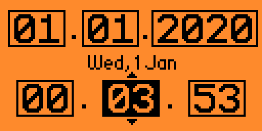
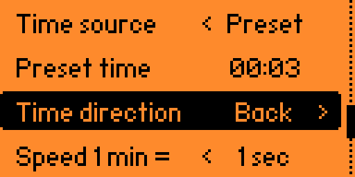
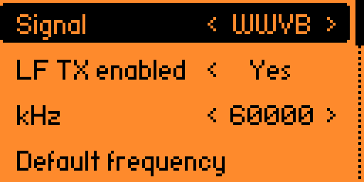
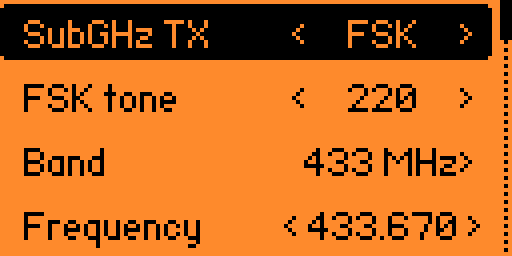
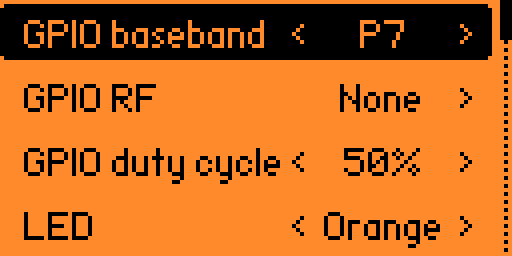
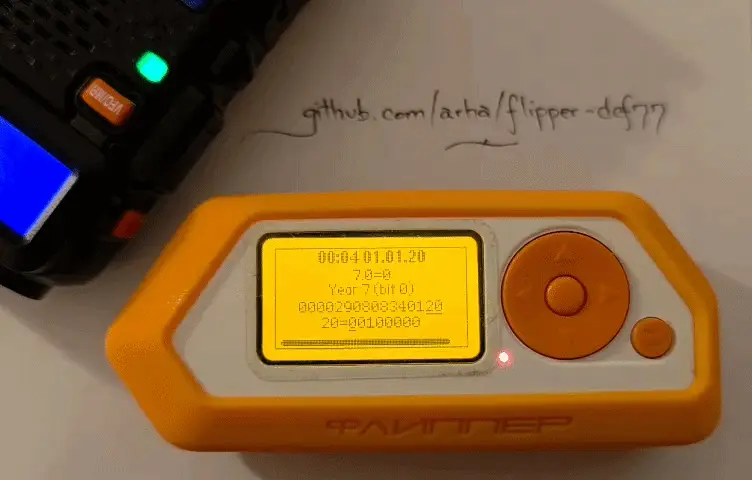

# Flipper DCF77
Compiled against 1.4.3. It's a radio clock emulator lab. 

[Radio clocks](https://en.wikipedia.org/wiki/Radio_clock) set clocks around the world using very slow messages. It can do DCF77, but many other OOK protocols too. Both the baseband signal and the RF signal can be output. You can even debug it or use it as a reference for other radioclock projects - you can output the signal to SubGHZ (and hear it on something like a Baofeng), on its piezo buzzer or on its LED. 

It uses its internal LF antenna to do a very bad emulation of 77.5 kHz. With some receivers, it does better if you try 125 kHz - the Flipper's resonant frequency - and move it very close, overloading it. With some receivers it does nothing. If you want to build a (home/room level) antenna, either try using through a tuned ferrite rod to ground, or with a transistor driven by the RF signal output. It's not really RF though, a 77.5 kHz signal from the Flipper won't travel more than a few meters.  Building a portable antenna for the LF/VLF band is left as an exercise for the reader.

Send real or custom time, choose how fast time moves and in what direction.

  
  

Multiple clocks supported; LF frequency can be changed at will. Try harmonics!

  

Enhanced debugging for writing your own radioclock software, including RF output and SubGHz audio.

  
  

# Features

* Wonky time experiments: 
  1. you can make time stop or go backwards
  2. you can alter the time speed - how many seconds must pass to increment the time sent? 1 minute as usual, or 5? You could consider every 10 seconds a full minute, so minutes would pass by 6x faster. Good to shoo away annoying guests. Better if they have a radioclock watch.
  3. NOTE: this only changes the timestamp the Flipper sends; to alter space-time you will need an expansion board
* LF frequency configurable 20-200 kHz
* LF test signal
* Supports multiple time signals: DCF77, WWVB, MSF, JJY, BPC, BSF, and HBG
* Improved debugging: configurable GPIO output: baseband & RF, LED, buzzer and, of course, SubGHz output
* Simulate bad reception (selective TX): can send only x/y frames, ie 1/3, 7/24, etc

# Technical details

### Yes, it finally has an UI!

* It works on every clock I own _eventually_. DCF77 is slow, it sends a complete update once per minute. Sometimes it works on the first try, sometimes I have to wait more than 5 attempts.
* I only had limited hardware to test HBG and JJY, so support there is less certain. MSF, WWVB, BPC, and BSF currently have better protocol-side coverage than real-world validation.
* Not doing anything but timed OOK. No PSK, no FSK.
* FZ does not do power modulation, it is simply on/off. The real transmitter modulates between full and reduced power. 
* The internal LF antenna is bad and you should feel bad for abusing it. 
* SubGHZ debugging (FSK and especially 100% FSK) is probably not great on CC1101 long term. There's a TX timeout option included.
* 100% FSK means there is no deviation happening during the dead time, but a carrier is still transmitted. This essentially keeps the CC1101 on 100% of the time, and it tends to drift.
* SubGHZ debugging in FSK modes means you will _hear_ a tone in your NFM receiver. Below is an example where my Flipper attempts to reverse COVID and 2020, by moving backwards in time at the rate of 1h/min. A very common NFM receiver beeps and boops in sync. 

  

# Todo

* simulate it as a simple timezone offset (for changing clocks around your house according to your country's choice of DST madness)
* Test it on citizen stuff: DCF77 ☑, WWVB ☑, MSF ☑, JJY ☑, BPC ☑, BSF ☑, HBG ☑. 
* ALS162 is PM and it is a significant effort from OOK. I'll need a good receiver first.
* RBU might work someday
